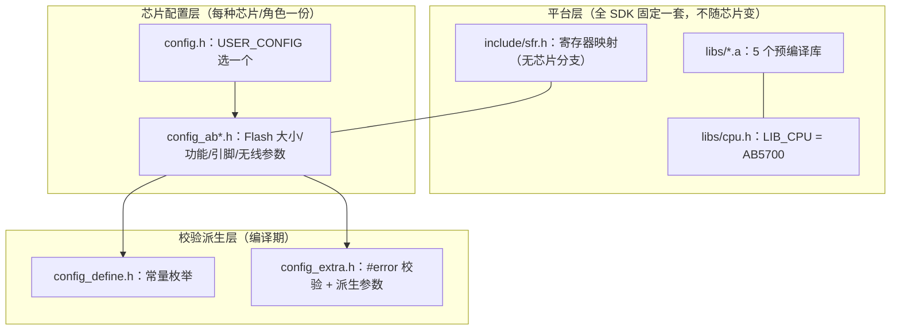
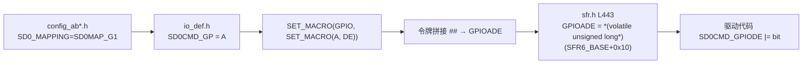
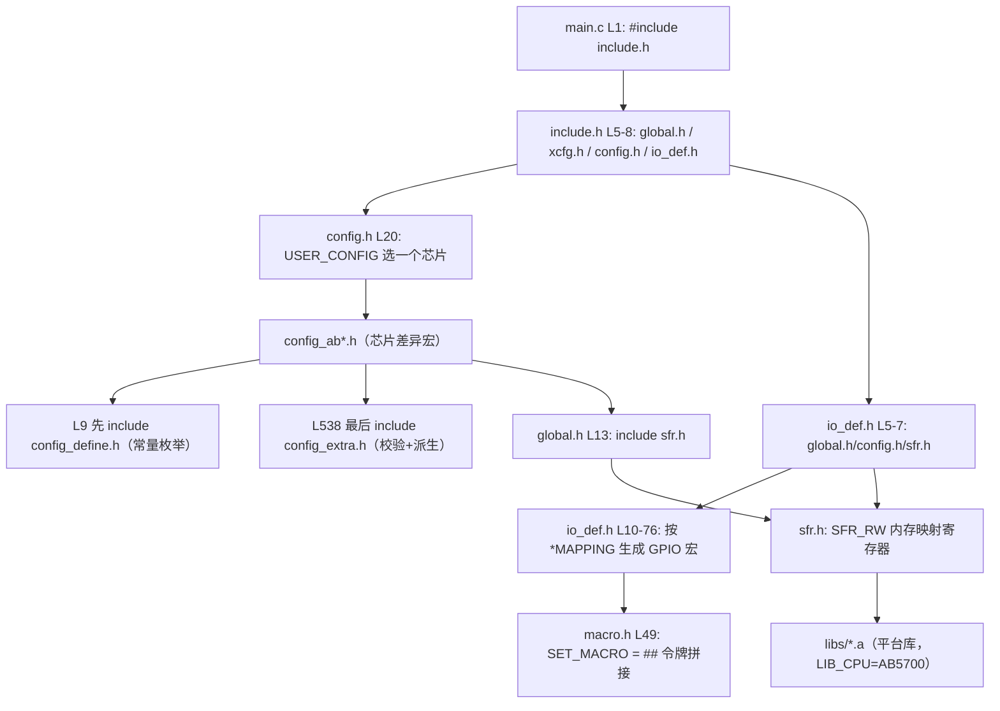

# 5706_RX SDK 多芯片支持原理

> 解释：`5706_RX/` 这一套 SDK 为什么能支持 AB5706A、AB5732E、AB5666、AB5766、AB570X 等多种芯片，以及既能做发送端（TX）又能做接收端（RX）两种角色。
>
> 所有调用/包含关系均来自实际代码，标注「文件 + 行号」。配套：
> - [`两个SDK差异对比.md`](两个SDK差异对比.md)
> - [`5726_TX_SDK多芯片支持原理.md`](5726_TX_SDK多芯片支持原理.md)

---

## 一、这套 SDK 支持哪些芯片/角色

`5706_RX/projects/microphone/config.h` L12-20 定义了 8 个配置枚举，L20 用 `USER_CONFIG` 选择其中一个：

| 枚举（config.h 行号） | 值 | 对应头文件 | 角色 |
|------|----|-----------|------|
| `CONFIG_AB5732E_LE_MIC_RX` | 0 | `config_ab5732e_rx.h` | 接收端 |
| `CONFIG_AB5706A_LE_MIC_RX` | 1 | `config_ab5706a_rx.h` | 接收端（当前启用） |
| `CONFIG_AB5706A_LE_MIC_TX` | 2 | `config_ab5706a_tx.h` | 发射端 |
| `CONFIG_AB5666_LE_MIC_RX` | 3 | `config_ab5666_rx.h` | 接收端 |
| `CONFIG_AB570X_LE_MIC_TX` | 4 | `config_ab570x_tx.h` | 发射端 |
| `CONFIG_LOW_LATENCY_RX` | 5 | `config_low_latency_rx.h` | 接收端（低延时） |
| `CONFIG_LOW_LATENCY_TX` | 6 | `config_low_latency_tx.h` | 发射端（低延时） |
| `CONFIG_AB5766_LE_MIC_RX` | 7 | `config_ab5766_rx.h` | 接收端 |

关键：**这些芯片/角色共用同一套 `sfr.h` 寄存器映射 + 同一套预编译库**，差异只在各自 `config_ab*.h` 里的宏。

> 注意：这套 SDK **既能做 TX 也能做 RX**（目录名「RX」只是本项目的用法）。上表有 3 个 TX 配置：`config_ab5706a_tx.h`、`config_ab570x_tx.h`、`config_low_latency_tx.h`。它们与 RX 配置的唯一区别就是 `FUNC_DEVICE_EN`/`FUNC_ADAPTER_EN` 取值相反（TX 为 1/0，RX 为 0/1），角色由 3.7 节的 `WIRELESS_MIC_ROLE` 机制派生。

---

## 二、核心原理：三层分离



一句话：**「多种芯片」其实是「同一 AB5700 平台的不同封装/容量/定位」，寄存器与库完全一致，差异只在配置宏。**

---

## 三、完整包含/调用关系梳理（带行号）

### 3.1 入口：`include.h` 拉起配置链

`5706_RX/include/include.h` L5-8：

```c
#include "global.h"
#include "xcfg.h"
#include "config.h"
#include "io_def.h"
```

`config.h` 是配置选择入口，`io_def.h` 是引脚映射抽象入口。

### 3.2 `config.h` 选中唯一的 `config_ab*.h`

`5706_RX/projects/microphone/config.h`：

- L12-19：定义 8 个 `CONFIG_*` 枚举。
- L20：`#define USER_CONFIG CONFIG_AB5706A_LE_MIC_RX` —— 选哪个芯片就改这里。
- L22-40：`#if / #elif` 精确 `#include` 一个 `config_ab*.h`（同一时刻只有一个被包含）。

```c
// config.h L22-40（节选）
#if (USER_CONFIG == CONFIG_AB5706A_LE_MIC_RX)
    #include "config_ab5706a_rx.h"
#elif (USER_CONFIG == CONFIG_AB5706A_LE_MIC_TX)
    #include "config_ab5706a_tx.h"
...
```

### 3.3 `config_ab*.h` 是芯片差异的唯一载体

以 `config_ab5706a_rx.h` 为例，它只定义宏，不含实现：

- L9：`#include "config_define.h"`（先引入常量枚举）
- L15-16：`FUNC_DEVICE_EN 0`、`FUNC_ADAPTER_EN 1`（角色）
- L38：`FLASH_SIZE FSIZE_256K`（5706B 封装 256K）
- L39：`FLASH_CODE_SIZE 236K`（程序区上限）
- L31：`UART0_PRINTF_SEL PRINTF_PB3`（打印口）
- L59：`WIRELESS_CON_VERS 6`（无线协议版本）
- L74：`WIRELESS_MIC_TX_INTERVAL 6`（无线帧周期）
- L276：`SPI_MAPPING SPI1MAP_G3`（SPI 引脚组）
- L440：`I2C_MAPPING I2CMAP_PA14PA13`（I2C 引脚组）
- L538：`#include "config_extra.h"`（最后做校验/派生）

对比另一颗芯片 `config_ab5732e_rx.h`：`FLASH_SIZE` 同样 `FSIZE_256K`（L38），`WIRELESS_CON_VERS` 也是 `6`（L59）——两颗芯片大部分宏相同，只在产品定位相关处有差（例如低延时版 `config_low_latency_rx.h` L75 的 `TX_INTERVAL` 是 `1`）。

**这就是「多芯片」的本质**：换芯片 = 换 `USER_CONFIG`，把对应的 `config_ab*.h` 的宏改对即可。

### 3.4 寄存器映射：一套 `sfr.h` 覆盖全平台

`5706_RX/include/sfr.h` 用「内存映射寄存器」方式定义寄存器：

- L7-9：
  ```c
  #define SFR_RO *(volatile unsigned long const *)
  #define SFR_WO *(volatile unsigned long*)
  #define SFR_RW *(volatile unsigned long*)
  ```
- L20：`#define SFR_BASE 0x00000100`（寄存器基址，0~255 保留）
- L21-39：`SFR0_BASE ~ SFR30_BASE` 分组基址
- L319-323：`PICCON / PICCONSET / PICCONCLR`（中断控制，`SFR4_BASE + 0x0c/0x0d/0x10 *4`）
- L443-450：`GPIOADE`、`GPIOAPU`、`GPIOAPU200K/300`（`SFR6_BASE` 组的 Port A GPIO）

关键证据：整个 `sfr.h` 只有 `#ifndef _KYLIN_SFR_`（L2）这类头文件保护，**没有任何 `AB5706 / AB5732` 之类的芯片条件分支**（可用 grep 验证）。即：同一平台，寄存器表只有一份。

### 3.5 平台标识：`cpu.h`

`5706_RX/libs/cpu.h` L4-5：

```c
#define STR_CPU "AB5700"   //for dump version
#define LIB_CPU AB5700     //for copy libs
```

`LIB_CPU` 决定链接哪一套平台库。`main.c` L36 `printf("Hello %s: %08x\n", STR_CPU, ...)` 打印的就是它。

### 3.6 引脚复用：`io_def.h` + 令牌拼接 `SET_MACRO`

不同芯片/封装引脚不同，但外设驱动代码要通用。做法：外设引脚用「映射组」抽象。

`5706_RX/include/io_def.h`：

- L5-7：`#include "global.h" / "config.h" / "sfr.h"`（拿到 `SD0_MAPPING` 等宏与寄存器定义）
- L10-66：`#if (SD0_MAPPING == SD0MAP_G1) ... #elif (SD0_MAPPING == SD0MAP_G2) ...` 把 SD 卡三根线（CMD/CLK/DAT）映射到不同 GPIO 端口（PA5/PA6/PA7、PB0/PB1/PB2、PE5/PE6/PE7…）
- L69-76：用令牌拼接生成寄存器访问宏：
  ```c
  #define SD0CMD_GPIODE   SET_MACRO(GPIO, SET_MACRO(SD0CMD_GP, DE))
  #define SD0CMD_GPIOFEN  SET_MACRO(GPIO, SET_MACRO(SD0CMD_GP, FEN))
  #define SD0CMD_GPIODIR  SET_MACRO(GPIO, SET_MACRO(SD0CMD_GP, DIR))
  ...
  ```

令牌拼接定义在 `5706_RX/include/macro.h`：

- L49：`#define SET_MACRO(x, y) CONST_CAT(x, y)`
- `CONST_CAT(x, y)` = `x ## y`（C 预处理器 `##` 把两个 token 粘成一个）

**拼接实例**：假设 `SD0CMD_GP = A`（io_def.h L12），则

```text
SET_MACRO(SD0CMD_GP, DE)   →  CONST_CAT(A, DE)   →  ADE
SET_MACRO(GPIO, ADE)       →  CONST_CAT(GPIO, ADE) → GPIOADE
```

最终 `SD0CMD_GPIODE` 展开成 `GPIOADE`，也就是 `sfr.h` L443 定义的寄存器。于是驱动层（`bsp/bsp_sd.c` 等）只写 `SD0CMD_GPIODE |= SD0CMD_BIT` 这种抽象宏，具体落到哪颗芯片的哪个引脚，由 config 里的 `SD0_MAPPING` 决定。



### 3.7 校验与派生：`config_extra.h`

`5706_RX/include/config_extra.h`（config_ab*.h 最后 `#include` 它）：

- L8：`#define SDK_VERSION 0x0150`
- **L581-589：角色派生** —— 由 `FUNC_DEVICE_EN` + `FUNC_ADAPTER_EN` 派生 `WIRELESS_MIC_ROLE`：
  ```c
  #if FUNC_ADAPTER_EN && FUNC_DEVICE_EN
      #define WIRELESS_MIC_ROLE  2    // 0=TX, 1=RX, 2=收发一体（运行期配置选择）
  #elif FUNC_ADAPTER_EN
      #define WIRELESS_MIC_ROLE  1    // 只做接收端 RX
  #elif FUNC_DEVICE_EN
      #define WIRELESS_MIC_ROLE  0    // 只做发送端 TX
  #else
      #define WIRELESS_MIC_ROLE  0xff // 都不支持
  #endif
  ```
  随后 L591-596 据此派生有效使能位 `ADAPTER_EN`/`DEVICE_EN`。
- L626-629：由采样率派生 `FRAME_SIZE_MIN`、`WIRELESS_MIC_DFU_TX_INTERVAL`
- L631-642：由 `WIRELESS_MIC_TX_INTERVAL` 派生 `WIRELESS_CON_INTERVAL`（12/60/64）
- L648-666：`#if WIRELESS_MIC_TX_INTERVAL == 0 → #error`、非法组合 `#error "not allowed!"`

`WIRELESS_MIC_ROLE` 在 `5706_RX/modules/wireless/wireless_proc.c` L312-316 的 `wireless_mic_role_init()` 中决定 `cfg_wireless_role`（ROLE==0 固定 TX、==1 固定 RX、==2 运行期按 xcfg 选）。**即 AB5700 SDK 同样具备「收发一体 + 运行期切换」能力，只是出厂 config 每个只开一个角色（ROLE=0/1），未启用 ROLE==2。**

作用：把「配置是否合法」提前到编译期报错，而不是运行时才发现。

### 3.8 启动流程（把配置串起来）

`5706_RX/projects/microphone/main.c` L33-43：

```c
int main(void) {
    sys_cb.rst_reason = sys_rst_init(POWKEY_10S_RESET);
    printf("Hello %s: %08x\n", STR_CPU, sys_cb.rst_reason);   // STR_CPU 来自 cpu.h
    printf("SDK: v%04X LIBS: v%04X\n", SDK_VERSION, LIBS_VERSION);
    sys_rst_dump(sys_cb.rst_reason);
    sys_init();    // 初始化外设/系统（内部用 io_def.h 的抽象宏配置引脚）
    func_run();    // 进入功能状态机（适配器/接收端逻辑）
    return 0;
}
```

`SDK_VERSION` 来自 `config_extra.h` L8，`LIBS_VERSION` 来自库符号 `libs_version`（`5706_RX/libs/api_sys.h` L148）。

---

## 四、编译期关系总图（mermaid）



---

## 五、知识点小结

1. **内存映射寄存器（SFR）**：芯片外设寄存器映射到内存地址空间，用 `*(volatile unsigned long*)addr` 访问（`sfr.h` L7-9）。读写某个地址就是操作某个外设。

2. **编译期配置选择**：`config.h` 用 `USER_CONFIG` + `#if/#elif` 只包含一个 `config_ab*.h`，避免多套代码共存、省 Flash。

3. **令牌拼接 `##`**：`CONST_CAT(x,y) = x##y`，把「前缀 + 端口 + 功能」拼成寄存器名（`GPIO` + `A` + `DE` = `GPIOADE`），实现引脚无关的驱动写法。

4. **`*_MAPPING` 引脚组**：`SD0_MAPPING`、`I2C_MAPPING`、`SPI_MAPPING` 等枚举（定义在 `config_define.h`），每个枚举对应一组物理引脚，`io_def.h` 按枚举展开成对应 GPIO 宏。

5. **`#error` 配置校验**：`config_extra.h` 用 `#if ... #error` 在编译期拦截非法参数组合。

---

## 六、新手快速上手

1. **换芯片/换角色**：改 `config.h` L20 的 `USER_CONFIG`，再确认对应 `config_ab*.h` 里 `FLASH_SIZE / FLASH_CODE_SIZE / *_MAPPING / 无线参数` 是否匹配硬件；做 TX 还是 RX 由该 config 的 `FUNC_DEVICE_EN`/`FUNC_ADAPTER_EN` 决定（出厂 config 都是二者开一）。
2. **加一个新芯片**：复制一份现有 `config_ab*.h` 改名，在 `config.h` 增加枚举 + `#elif` 分支，改宏即可（寄存器/库不动）。
3. **编译**：
   ```powershell
   powershell -ExecutionPolicy Bypass -NoProfile -File "5706_RX/projects/microphone/build.ps1" -Rebuild
   ```
4. **验证配置**：编译期 `#error` 会直接提示非法参数；烧录后串口 `Hello AB5700` + `SDK: v0150` 确认平台与版本。
