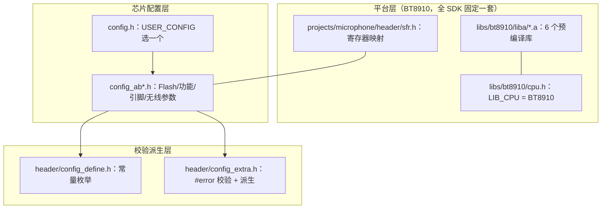
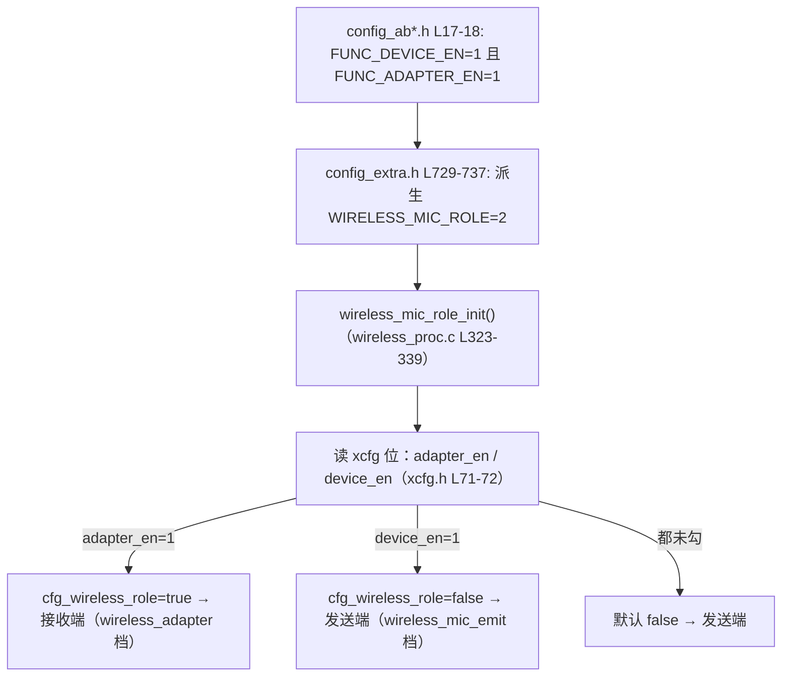
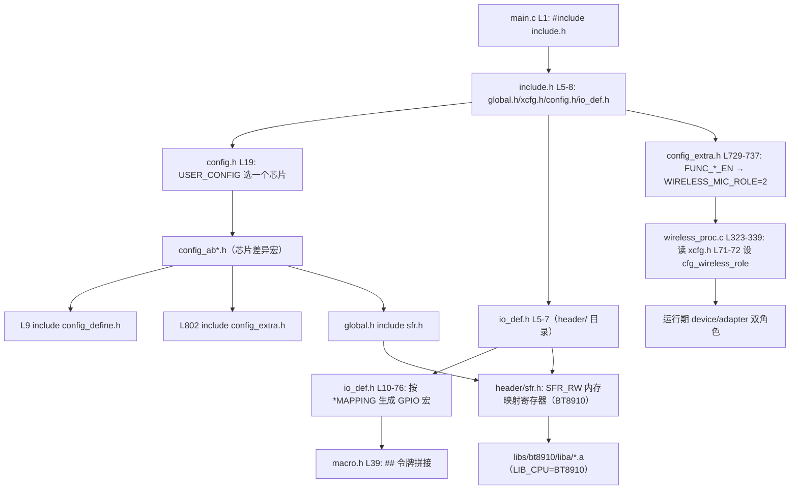

# 5726_TX SDK 多芯片支持原理

> 解释：`5726_TX/` 这一套 SDK 为什么能支持 AB5732E、AB5706A、AB5712F、AB5700 等多种芯片/形态（领夹麦、K 歌话筒、对讲机、低延时、一拖二…）。
>
> 所有调用/包含关系均来自实际代码，标注「文件 + 行号」。配套：
> - [`两个SDK差异对比.md`](两个SDK差异对比.md)
> - [`5706_RX_SDK多芯片支持原理.md`](5706_RX_SDK多芯片支持原理.md)

---

## 一、这套 SDK 支持哪些芯片/形态

`5726_TX/projects/microphone/config.h` L12-19 定义 7 个配置枚举，L19 用 `USER_CONFIG` 选择：

| 枚举（config.h 行号） | 值 | 对应头文件 | 形态 |
|------|----|-----------|------|
| `CONFIG_AB5732E_LE_MIC` | 0 | `config_ab5732e_le_mic.h` | 领夹麦 |
| `CONFIG_AB5706A_LE_MIC` | 1 | `config_ab5706a_le_mic.h` | 领夹麦（当前启用） |
| `CONFIG_AB5712F_LE_MIC` | 2 | `config_ab5712f_le_mic.h` | 领夹麦 |
| `CONFIG_LOW_LATENCY` | 3 | `config_low_latency.h` | 低延时一拖一 |
| `CONFIG_AB5732E_INTERPHONE` | 4 | `config_ab5732e_interphone.h` | 对讲机 |
| `CONFIG_AB5700_KBOX` | 5 | `config_ab5700_kbox.h` | K 歌话筒 |
| `CONFIG_AB5732E_DIFF_CON_VERS` | 6 | `config_ab5732e_diff_con_vers.h` | 一拖二双 con_vers |

与 `5706_RX` 一样：这些形态共用同一套 `sfr.h` 寄存器映射 + 同一套预编译库，差异只在 `config_ab*.h` 宏。结构上的不同点：平台头放在 `projects/microphone/header/`、外设驱动放在 `projects/microphone/cpu/`（见 3.4）。另外本 SDK 所有 config 都把 `FUNC_DEVICE_EN`/`FUNC_ADAPTER_EN` 设为 both=1，启用「收发一体、运行期选角色」（见 3.6；该机制与 5706_RX 相同，只是出厂选值不同）。

---

## 二、核心原理（与 5706_RX 相同的三层分离）



唯一本质区别：平台从 **AB5700** 换成 **BT8910**，所以平台层文件路径与库目录都变了，但「三层分离」的思想完全一致。

---

## 三、完整包含/调用关系梳理（带行号）

### 3.1 入口

`5726_TX/include/include.h` L5-8：

```c
#include "global.h"
#include "xcfg.h"
#include "config.h"
#include "io_def.h"
```

与 RX 相同。注意 TX 的 `include.h` 比 RX 多两段：L14 `#include "periph.h"`（外设驱动，替代 RX 的 `bsp.h`）、L31-60 TWS 时钟宏。

### 3.2 `config.h` 选中唯一的 `config_ab*.h`

`5726_TX/projects/microphone/config.h`：

- L12-18：7 个 `CONFIG_*` 枚举
- L19：`#define USER_CONFIG CONFIG_AB5706A_LE_MIC`
- L22-38：`#if / #elif` 精确 `#include` 一个 `config_ab*.h`

### 3.3 `config_ab*.h` 是差异载体

以 `config_ab5706a_le_mic.h` 为例：

- L9：`#include "config_define.h"`
- L17-18：`FUNC_DEVICE_EN 1`、`FUNC_ADAPTER_EN 1`（both=1 → `WIRELESS_MIC_ROLE 2` 收发一体；RX SDK 的 config 则二者只开其一，机制相同）
- L55：`FLASH_SIZE FSIZE_512K`
- L56：`FLASH_CODE_SIZE 492K`
- L36：`UART0_PRINTF_SEL PRINTF_PB3`
- L289：`WIRELESS_CON_VERS 6`
- L311：`WIRELESS_MIC_TX_INTERVAL 6`
- L694：`SD0_MAPPING SD0MAP_G1`
- L705：`I2C_MAPPING I2CMAP_PE7E6`
- L802：`#include "config_extra.h"`

### 3.4 平台头下沉到项目内（目录结构差异）

RX 的平台头在全局 `include/`，TX 的则在 `projects/microphone/header/`，由构建脚本 include 路径决定：

`5726_TX/projects/microphone/build.ps1` L147-158（节选）：

```powershell
$INCLUDES = @(
    '-I.','-Iheader','-Iport','-Iplugin','-Icpu',
    ...
    '-I..\..\libs\bt8910\liba','-I..\..\libs\bt8910',
    '-I..\..\include','-I..\..\3rd-party','-I..\..\system',
    ...
)
```

- `-Iheader` → `projects/microphone/header/`（`sfr.h`、`io_def.h`、`config_define.h`、`config_extra.h`）
- `-I..\..\libs\bt8910\liba` → 平台库的头文件（`api_*.h`）

`header/sfr.h` 是 BT8910 的寄存器表：L9 `SFR_RW *(volatile unsigned long*)`、L20 `SFR_BASE 0x00000100`、L222 `PICCON`。它与 RX 的 `sfr.h` 是两份不同平台的表——例如 L248-260 把 Port A（`GPIOASET`~`GPIOAPD300`）整段注释，只开放 Port B/E/G（L262-314），说明 BT8910 的 IO 布局与 AB5700 不同。

### 3.5 平台标识：`cpu.h`

`5726_TX/libs/bt8910/cpu.h`：

- L4-5：`STR_CPU "BT8910"`、`LIB_CPU BT8910`
- L7-13：还带 CPU 内联宏（RX 的同类宏在 `include/global.h` L15-16）：
  ```c
  #define GLOBAL_INT_DISABLE()  uint32_t cpu_ie = PICCON&BIT(0); PICCONCLR = BIT(0); ...
  #define WDT_CLR()             {WDTCON = 0xa; RTCCON10 = BIT(14);}
  ```

### 3.6 收发一体 + 运行期角色切换（机制与 5706_RX 相同，只是出厂选值不同）

先澄清：这个「收发一体 + 运行期选角色」的机制**两套 SDK 完全相同**（`FUNC_*_EN` → `WIRELESS_MIC_ROLE`），不是 BT8910 独有。区别只在于**出厂 config 怎么设**——AB5700 的 config 每个只开一个角色（ROLE=0/1，编译期固定），而 BT8910 的所有 config 都 both=1（ROLE=2，运行期选）。

派生逻辑在 `header/config_extra.h` L729-737：

```c
#if FUNC_ADAPTER_EN && FUNC_DEVICE_EN
    #define WIRELESS_MIC_ROLE  2    // 0=TX, 1=RX, 2=收发一体（运行期配置选择）
#elif FUNC_ADAPTER_EN
    #define WIRELESS_MIC_ROLE  1    // 只做接收端 RX
#elif FUNC_DEVICE_EN
    #define WIRELESS_MIC_ROLE  0    // 只做发送端 TX
#else
    #define WIRELESS_MIC_ROLE  0xff // 都不支持
#endif
```

本 SDK 所有 config 都 `FUNC_DEVICE_EN=1` 且 `FUNC_ADAPTER_EN=1`（`config_ab5706a_le_mic.h` L17-18），所以 ROLE=2，`wireless_mic_role_init()` 走运行期分支：

```c
// wireless_proc.c L323-339
#if WIRELESS_MIC_ROLE == 0      cfg_wireless_role = false;  // 固定 TX
#elif WIRELESS_MIC_ROLE == 1    cfg_wireless_role = true;   // 固定 RX
#elif WIRELESS_MIC_ROLE == 2
    if (xcfg_cb.wireless_adapter_en)      cfg_wireless_role = true;   // RX
    else if (xcfg_cb.wireless_device_en)  cfg_wireless_role = false;  // TX
    else                                  cfg_wireless_role = false;  // 默认 TX
#endif
```

运行期依据两个 xcfg 位（`xcfg.h` L71-72，烧录时配置工具写入）：

```c
u32 wireless_adapter_en : 1;   //无线mic接收端使能
u32 wireless_device_en  : 1;   //无线mic发射端使能
```



于是同一份 TX 固件，烧 `wireless_mic_emit` 档 = 发送端、`wireless_adapter` 档 = 接收端，无需重编译。代码里大量 `if (wireless_role_is_adapter())`（`api_wireless.h` L115 = `cfg_wireless_role`）分支据此走不同逻辑。

#### 设计初衷：为什么 BT8910 出厂就 both=1？是否浪费 Flash/RAM？

- **显式证据**：`FUNC_DEVICE_EN`/`FUNC_ADAPTER_EN` 的注释（两套 SDK 一致）写的是「是否打开发射器功能（**只做接收时关闭，节省空间**）」「是否打开接收器功能（**只做发送时关闭，节省空间**）」——即这对宏本身就是厂商提供的「省空间 vs 灵活」开关。
- **容量证据**：BT8910 config `FLASH_SIZE FSIZE_512K`（`config_ab5706a_le_mic.h` L55）放得下两套角色代码；AB5700 接收端 config `FLASH_SIZE FSIZE_256K`（`config_ab5706a_rx.h` L38，5706B 封装 256K）较紧，所以 AB5700 出厂 config 每个只开一个角色。
- **设计初衷（基于以上证据的推断，非厂商明文）**：BT8910 有足够 Flash，厂商统一 both=1、ROLE=2，得到「**一份固件既可作为发送端、也可作为接收端**」——烧录时用配置工具勾选 `wireless_device_en`/`wireless_adapter_en` 即可，无需为 TX/RX 分别编译、分发、维护两套固件（减少 SKU）。
- **代价**：主要是 **Flash**——`functions/func_device.c`（发射端状态机，L15 `#if FUNC_DEVICE_EN`）与 `functions/func_adapter.c`（接收端状态机，L16 `#if FUNC_ADAPTER_EN`）两套功能代码都会被链接进来。**RAM 代价小**：音频/无线编解码缓冲区两角色共享，角色相关的静态状态很小。纯单角色产品可手动把其中一个 `FUNC_*_EN` 置 0 省 Flash（即注释所说的「节省空间」）。

### 3.7 引脚复用：与 RX 同机制，只是映射表不同

`5726_TX/projects/microphone/header/io_def.h`：

- L5-7：`#include "global.h" / "config.h" / "sfr.h"`
- L10-66：`#if (SD0_MAPPING == SD0MAP_G1) ... #elif ...` 把 SD 引脚映射到不同 GPIO（注意：RX 的 G1 是 PA5/PA6/PA7，TX 的 G1 是 PE5/PE6/PE7——两平台引脚定义不同）
- L69：`#define SD0CMD_GPIODE SET_MACRO(GPIO, SET_MACRO(SD0CMD_GP, DE))`

令牌拼接宏同 RX：`5726_TX/include/macro.h` L39 `SET_MACRO(x,y)=CONST_CAT(x,y)`，`CONST_CAT(x,y)=x##y`。

### 3.8 校验派生：`header/config_extra.h`

- L8：`#define SDK_VERSION 0x013`
- L14-20：`#if VDDIO_LIMIT_SEL > 7 → #error` 等
- **L729-737：角色派生** —— `FUNC_DEVICE_EN`+`FUNC_ADAPTER_EN` → `WIRELESS_MIC_ROLE`（0/1/2/0xff，与 RX `config_extra.h` L581-589 逐字一致，见 3.6）
- L767-811：无线 `TX_INTERVAL / CON_INTERVAL / COMB_NB` 派生与 `#error` 校验（与 RX `config_extra.h` L626-669 同逻辑）

### 3.9 启动流程

`5726_TX/projects/microphone/main.c` L52-70：

```c
int main(void) {
    sys_cb.rst_reason = sys_rst_init(POWKEY_10S_RESET);
    printf("Hello %s: %08x\n", STR_CPU, sys_cb.rst_reason);   // STR_CPU=BT8910
    printf("SDK: v%04X LIBS: v%04X\n", SDK_VERSION, LIBS_VERSION);
    sys_rst_dump(sys_cb.rst_reason);
    sys_init();
    func_run();   // 内部按 cfg_wireless_role 进入 device 或 adapter 状态机
    return 0;
}
```

`LIBS_VERSION` 来自库符号 `libs_version`（`5726_TX/libs/bt8910/liba/api_sys.h` L125）。

---

## 四、编译期 + 运行期关系总图（mermaid）



---

## 五、知识点小结

1. **平台头下沉**：TX 把 `sfr.h / io_def.h / config_define.h / config_extra.h` 放在 `projects/microphone/header/`，通过 `build.ps1` 的 `-Iheader` 引入；`include/` 只留通用头。这样同一工程可以针对不同平台各放一套 `header/`（本仓库只有 BT8910 一套）。

2. **收发一体**：`FUNC_DEVICE_EN` 与 `FUNC_ADAPTER_EN` 同时为 1 → `config_extra.h` L729-737 派生 `WIRELESS_MIC_ROLE=2` → `wireless_mic_role_init()` 运行期读 xcfg 位 `wireless_adapter_en`/`wireless_device_en` 决定角色，一份固件两种用法（该机制 5706_RX 也有）。

3. **xcfg**：配置工具（xmaker/xcfg）生成的 `xcfg.h` 里的结构体 `xcfg_cb`，把「烧录时可改的参数」从「编译期宏」中分离出来；`wireless_adapter_en` 就是典型。

4. **平台寄存器表不同**：BT8910（TX）与 AB5700（RX）的 `sfr.h` 不是同一份，GPIO 端口可用性不同（TX 无 Port A/F）。

---

## 六、新手快速上手

1. **换芯片/形态**：改 `config.h` L19 的 `USER_CONFIG`（领夹麦/对讲机/K 歌话筒/低延时…），再核对 `config_ab*.h` 的 Flash、无线参数、引脚映射。
2. **选角色（不重新编译）**：烧录时配置工具选 `wireless_mic_emit`（发送端）或 `wireless_adapter`（接收端）。
3. **编译**：
   ```powershell
   powershell -ExecutionPolicy Bypass -NoProfile -File "5726_TX/projects/microphone/build.ps1" -Rebuild
   ```
4. **验证**：串口打印 `Hello BT8910` + `SDK: v013`；运行时打印 `emit, ...`（发送端）或 `adapter, ...`（接收端）确认角色。
