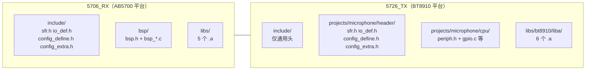

# 两个 SDK 差异对比（5706_RX vs 5726_TX）

> 本文件对比本仓库中的两套 JieLi 无线麦 SDK：
> - `5706_RX/`：接收端 SDK（CPU 平台 **AB5700**）
> - `5726_TX/`：发送端 SDK（CPU 平台 **BT8910**）
>
> 所有结论均来自实际代码，标注了「文件 + 行号」。配套阅读：
> - [`5706_RX_SDK多芯片支持原理.md`](5706_RX_SDK多芯片支持原理.md)
> - [`5726_TX_SDK多芯片支持原理.md`](5726_TX_SDK多芯片支持原理.md)

---

## 一句话结论

两套 SDK 同属 JieLi 无线麦 SDK 家族，代码风格一致，但**目标 CPU 平台不同**：`5706_RX` 基于 **AB5700** 平台，`5726_TX` 基于 **BT8910** 平台。平台不同，导致寄存器映射（`sfr.h`）、预编译库（`.a`）、目录组织、角色选择方式都不一样；但「一个 SDK 支持多种芯片」的机制是相同的（见另外两份文档）。

平台标识来自各自的 `cpu.h`：

| SDK | cpu.h | STR_CPU | LIB_CPU |
|-----|-------|---------|---------|
| 5706_RX | `5706_RX/libs/cpu.h` L4-5 | `"AB5700"` | `AB5700` |
| 5726_TX | `5726_TX/libs/bt8910/cpu.h` L4-5 | `"BT8910"` | `BT8910` |

`LIB_CPU` 注释为 `//for copy libs`，即它决定构建时拷贝/链接哪一套平台库。

---

## 差异总表

| 维度 | 5706_RX（AB5700） | 5726_TX（BT8910） | 代码证据 |
|------|------------------|------------------|----------|
| CPU 平台标识 | `AB5700` | `BT8910` | `libs/cpu.h` L4-5 / `libs/bt8910/cpu.h` L4-5 |
| 预编译库数量 | 5 个 | 6 个（多 `libeffects.a`） | `build.ps1` L157-158 / L160-165 |
| 预编译库路径 | `libs/*.a` | `libs/bt8910/liba/*.a` | 同上 |
| 平台头文件位置 | `include/`（sfr/io_def/config_define/config_extra） | `projects/microphone/header/` | `build.ps1` L149 / L148 |
| 外设驱动位置 | 根目录 `bsp/`（`bsp.h` 引入） | `projects/microphone/cpu/`（`periph.h` 引入） | `include/include.h` L15 / L14 |
| 角色选择方式 | 编译期固定为接收端 | 收发一体，运行期由 xcfg 切换 | `config_ab5706a_rx.h` L15-16 / `config_ab5706a_le_mic.h` L17-18 |
| Flash 下限 | 支持 256K（`FSIZE_256K`） | 最低 512K（无 `FSIZE_256K`） | `config_ab5706a_rx.h` L38 / `config_ab5706a_le_mic.h` L55 |
| 蓝牙功能 | 关（`FUNC_BT_EN 0`），代码被裁剪 | 开（`FUNC_BT_EN 1`），含完整 BT 栈 | `config_ab5706a_rx.h` L17 / `config_ab5706a_le_mic.h` L16 |
| 编解码枚举 index 5 | `WS_CODEC_USER0` | `WS_CODEC_LC3F`（LC3 5ms） | `include/config_define.h` L436 vs `header/config_define.h` L403 |
| SDK 版本 | `0x0150` | `0x013` | `include/config_extra.h` L8 / `header/config_extra.h` L8 |
| 内存堆大小 | `9*1024` | `13*1024` | `main.c` L3 / `main.c` L3 |
| 寄存器映射差异 | 有 GPIO Port A（`GPIOADE` 等） | Port A/F 被注释，用 B/E/G | `include/sfr.h` L443 / `header/sfr.h` L248-302 |

---

## 详细说明

### 1. CPU 平台不同 → 寄存器映射与库不同

`sfr.h` 是寄存器映射文件，用内存映射方式定义寄存器（见多芯片原理文档）。两份 `sfr.h` 是**两份不同平台**的寄存器表：

- RX `include/sfr.h` L443 定义了 `GPIOADE`（SFR6 组的 Port A 数据使能寄存器）。
- TX `header/sfr.h` L248-260 把 Port A（`GPIOASET`~`GPIOAPD300`）**整段注释掉**，L262-288 只定义 Port B/E，L305+ 定义 Port G。

这说明 BT8910 与 AB5700 的外设/IO 布局不同，两套 SDK 各自只带一套平台寄存器表。

预编译库也按平台分：
- RX：`libs/libplatform.a`、`libbtstack.a`、`libcodecs.a`、`libdrivers.a`、`libvoices.a`（5 个，**无** libeffects）。
- TX：`libs/bt8910/liba/` 下 6 个，**多** `libeffects.a`（音效库）。

链接清单见 `build.ps1`：RX L157-158、TX L160-165。

### 2. 平台头文件的位置不同

- RX 把平台头 `sfr.h / io_def.h / config_define.h / config_extra.h` 放在**全局** `include/`（`build.ps1` L149 的 `-I..\..\include` 即可找到）。
- TX 把同样的四份头放在**项目内** `projects/microphone/header/`（`build.ps1` L148 的 `-Iheader` 找到），`include/` 只留 `global.h / include.h / macro.h / clib.h / typedef.h / s_common.h` 这类通用头。

### 3. 外设驱动目录不同

- RX：根目录 `bsp/`，通过 `include/include.h` L15 `#include "bsp.h"` 引入。
- TX：`projects/microphone/cpu/`（`periph.h`、`gpio.c`、`uart0.c`、`i2c.c`、`saradc.c`…），通过 `include/include.h` L14 `#include "periph.h"` 引入。

### 4. 角色（发送端/接收端）选择方式不同（关键）

- **RX 是「单接收端」**：`config_ab5706a_rx.h` L15-16
  ```c
  #define FUNC_DEVICE_EN   0   // 发射器功能关
  #define FUNC_ADAPTER_EN  1   // 接收器功能开
  ```
  编译期就把发射端代码裁掉，只能做接收端。

- **TX 是「收发一体」**：`config_ab5706a_le_mic.h` L17-18 两个都开：
  ```c
  #define FUNC_DEVICE_EN   1
  #define FUNC_ADAPTER_EN  1
  ```
  运行时再决定角色，依据是配置工具写入的 xcfg 位 `wireless_adapter_en`：
  - `xcfg.h` L71 `u32 wireless_adapter_en : 1;`
  - `modules/wireless/wireless_proc.c` L323-336 `wireless_mic_role_init()` 读它并赋值 `cfg_wireless_role`
  - `libs/bt8910/liba/api_wireless.h` L115 `#define wireless_role_is_adapter() cfg_wireless_role`

  因此同一份 TX 固件，烧录时选 `wireless_mic_emit` 档 = 发送端，选 `wireless_adapter` 档 = 接收端。

### 5. 其它功能面差异

- 蓝牙：TX 打开完整蓝牙（`FUNC_BT_EN 1`），带 `modules/bluetooth/` 全套 + `ab_mate` 应用；RX 关蓝牙（`FUNC_BT_EN 0`），仅保留 `libs/strong_*.c` 等空桩裁剪。
- Flash：RX 有 `FSIZE_256K`（`include/config_define.h` L31，适配 5706B 的 256K 封装）；TX 的 `header/config_define.h` 只有 512K/1M/2M/4M。
- 编解码：两份 `config_define.h` 的 `WS_CODEC_*` 枚举数量相同（各 11 个，ADPCM/OPUS/MSBC/LC3/LC3S/SBC/LC3B 都有），唯一差异是 index 5：RX 为 `WS_CODEC_USER0`（`include/config_define.h` L436），TX 为 `WS_CODEC_LC3F`（LC3 5ms，`header/config_define.h` L403）。

---

## 目录结构对比（mermaid）



---

## 知识点

1. **`LIB_CPU` / `STR_CPU`**：`cpu.h` 里的平台标识。`STR_CPU` 用于打印版本串（`main.c` L36/L55 `printf("Hello %s", STR_CPU)`），`LIB_CPU` 用于「拷贝/链接哪一套平台库」（`//for copy libs`）。

2. **平台库 `.a`**：芯片底层的硬件驱动、协议栈、编解码器以预编译静态库形式提供，一套库对应一个平台；同一平台的所有芯片共用这套库（这就是「一个 SDK 支持多芯片」的硬件底座，详见多芯片原理文档）。

3. **收发一体 vs 单接收端**：`FUNC_DEVICE_EN / FUNC_ADAPTER_EN` 控制是否编译发射/接收代码。两者都开 = 收发一体，角色交给 xcfg 运行时决定；只开一个 = 编译期固定角色（省 Flash）。

4. **`FSIZE_256K`**：Flash 容量枚举，RX 有（适配 5706B 小容量封装），TX 没有（BT8910 系列最低 512K）。Flash 大小直接决定 `FLASH_CODE_SIZE`（程序区上限）与 FOTA 分区规划。
